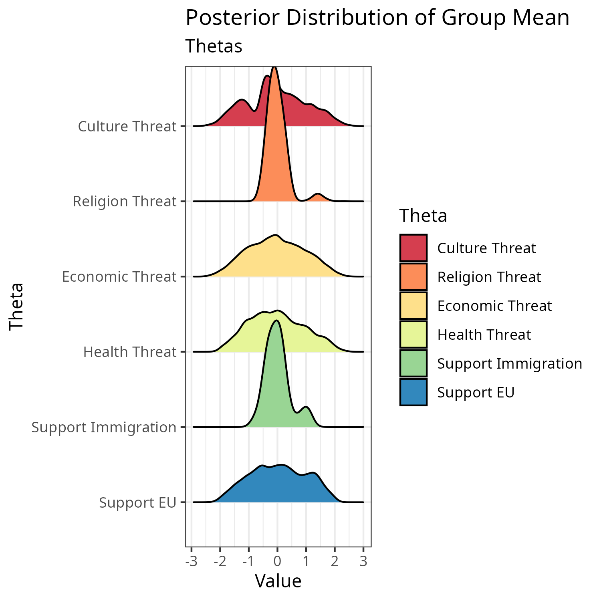
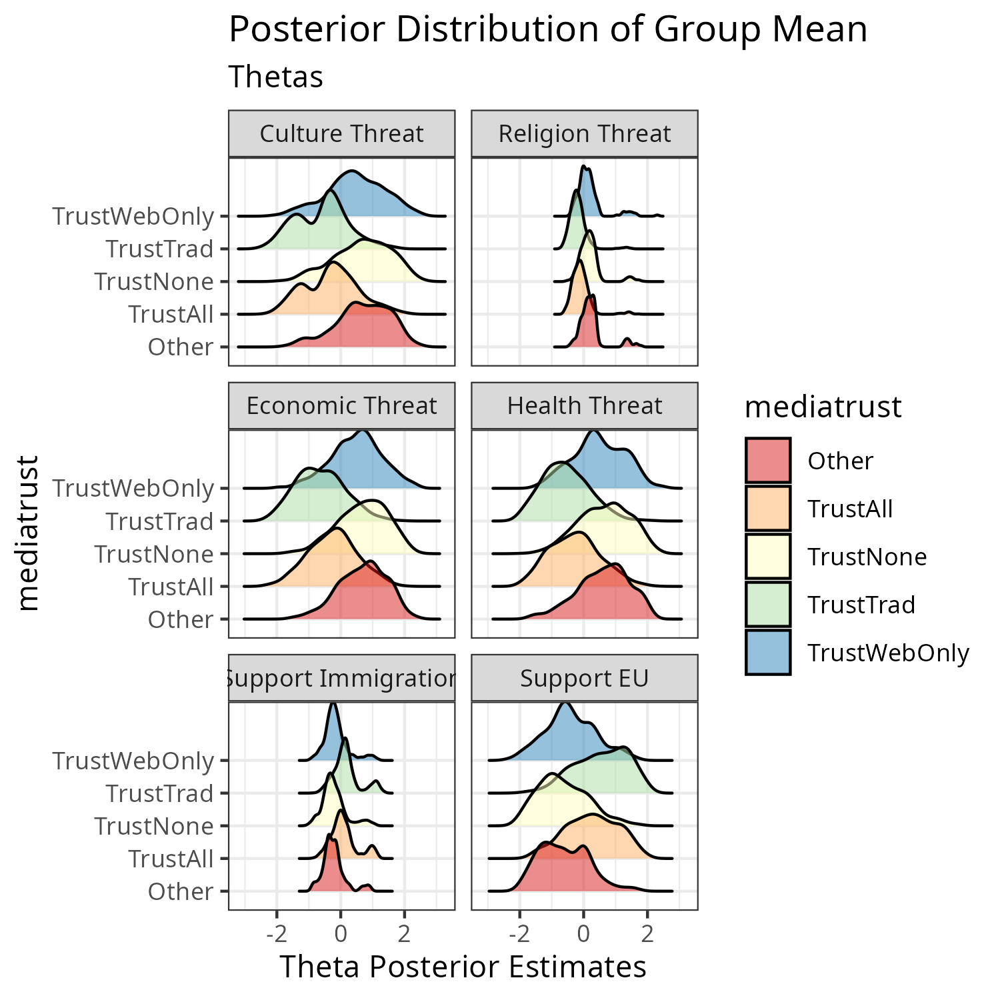

```{r setup, include = FALSE}
knitr::opts_chunk$set(
  collapse = TRUE,
  comment = "#>"
)
```

Packages that we will use for data prep, IRT-M estimation, and data visualization:
```{r packages, eval=T, echo=T, message=F, warning = FALSE}
## Data prep:
library(tidyverse) # version: tidyverse_2.0.0 
library(dplyr) #version: dplyr_1.1.4
library(stats) # version: stats4
library(fastDummies) # version: fastDummies_1.7.3
library(reshape2) #version: reshape2_1.4.4

## IRT-M estimation:
#devtools::install_github("dasiegel/IRT-M")
library(IRTM) #version 1.00

## Results visualization: 
library(ggplot2)  # version: ggplot2_3.4.4
library(ggridges) #version: ggridges_0.5.6 
library(RColorBrewer) #version: RColorBrewer_1.1-3
library(ggrepel) # version: ggrepel_0.9.5 
```

In this document we narratively walk through use of the IRT-M package.  

While the IRT-M framework is case agnostic, this vignette focuses on a single use case in which a hypothetical research team is interested in seeking empirical support for the hypothesis that anti-immigration attitudes in Europe are associated with perceptions of cultural, economic, and security threats. We illustrate data preparation, IRT-M estimation, visualization, and analysis with a small synthetic dataset (N=3000) based on the Eurobarometer 94.3. The real data can be accessed via: \url{https://search.gesis.org/research_data/ZA7780?doi=10.4232/1.14076}.

This example illustrates one of the strengths of the IRT-M model; namely the (very common) situation in which researchers have a theoretical question and related data that does not directly address the substantive question of interest. In this case, we work through a research question derived from the literature on European attitudes towards immigration. The threat response hypothesis is supported by the literature~\cite{kentmen2017anti} but  was not a specific focus of the 2020-2021 Eurobarometer wave. Consequentially, the survey did not directly ask questions about the three threat dimensions of interest.  However, the survey contained several questions adjacent to threat perception.  We can use these questions to build an M-Matrix and estimate latent threat dimensions.

Regardless of the use case, there are three steps to  preparing data for the IRT-M Package:

+ First, create a key for how you expect your theory to interact with the data. 
+ Next, format the data so that it can be parsed by the sampler. 
+ Third, create anchor points for the resulting scale.


## Loading the package

Gfortran is a necessary to load the package. Gfortran can be readily downloaded and the version installed can be checked: On Windows, enter into the command line "$ gfortran --version GNU Fortran." On Mac, enter into the terminal "which gfortran." After gfortran has been successfully installed, it is important to also have GCC (GNU Compiler Collection) installed. 

## Formatting the Observed Data

Formatting the Data

IRT-M requires that users convert categorical variables into a numeric format with one response loaded into each input object (aka: question). The most straightforward way to do this is to use a library, such as `fastDummies` to expand the entire instrument into one-hot or binary encoding. This is also a good opportunity to export an empty data-frame with the list of question codes, to code the M-Code object. Doing so reduces the likelihood of formatting slippages that are tedious to fix.  We have also found it to be worthwhile to insert column with human-readable notes next to the question codes. This step adds some overhead, but--- much like commenting code in general--- is invaluable for debugging and analysis.

## Creating the M-Matrix

The core step in using the IRT-M package is to map the underlying theoretical constructions of interest into an 'M-Matrix' of dimension loadings. In order to develop the loadings, we go through every question on the "test" object (here: every question in the survey) and decide whether the question relates to one of our hypothesized theoretical dimensions. For those questions that we believe load on the theoretical dimension of interest, we can code whether we expect it to positively load---meaning that an affirmative response implies more of the dimension--- or negatively load. We code positive "loading" as $1$ in the M-Matrix, negative "loading" as $-1$. We can also denote that the question has no relationship with the theoretical dimension of interest, in which case we code 0 into the dimension. If we are unsure, not coding the loading inserts $NA$ value, and the model will learn any loading during the estimation step.

To begin, we reformat data so that each possible answer becomes a separate binary question (One Hot encoding). In preparing the data, we used the `dummy_cols()` utility from the `fastdummies` package.  Finally, we rename the new binary dataframe as `Y` to underscore that this is the observed data that we will be modeling. Please ensure that the `dataPath` variable is adjusted for your local file structure.

```{r load-dat, eval=T, echo=T, message=F, warning = FALSE}

data("synth_questions")

colnames(synth_questions)

## Convert numeric ordinal responses to factors

ebdatsub <- lapply(synth_questions[,], factor) ## that's a list now

## converts the list back into a dataframe:
ebbinary <- dummy_cols(.data=ebdatsub,
                       remove_selected_columns=TRUE)

Y <- ebbinary ## data

## remove the .data that dummy_cols adds to the column names
colnames(Y) <- gsub(".data.", '', colnames(Y))

## remove the data objects:
rm(ebdatsub)
rm(synth_questions)
```

In this case, we are interested whether respondents to the 2021 Eurobarometer reported feeling social, cultural, and/or economic threats. Depending on the data, you may need to do some additional processing at this step to ensure that each question coded is a binary response has a single relationship to each dimension being coded. Many surveys present questions formatted into feelings thermometers, matrices, or with many nested sub-questions. These may not load straightforwardly into a single dimension. For example, Question 377 (qa1.4) in our data asks for respondents' feelings about various current situations, compactly presented via a feeling thermometer for several sub-questions. In this example we will code the fourth, “How would you judge the current situation in [….] your personal job situation.” The respondent’s answer is coded as categorical variable ranging from 1-4, with a response of 1 corresponding to “Very Good” and 4 corresponding to “Very Bad.”  We imagine that this question directly relates to the “economic threat” underlying dimension that we hypothesize, with the negative end of the scale indicating feelings of economic threat and a negative answer suggesting no threat.

Thus, we expand the levels of the question prompt to become four separate yes/no questions:

+ qa1a_4_1. Situation of personal job: very good. 
+ qa1a_4_2 Situation of personal job: rather good
+ qa1a_4_3 Situation of personal job: rather bad
+ qa1a_4_4. Situation of personal job: very bad  

Now we can use these prompts to code for our theoretical loading. In the M-Code matrix, we add a 1 to the column for the Economic Threat dimension for qa1a_4_3 and qa1a_4_4. Substantively, this means that responses to the qa1.4 with a value in the data of “3” or “4" are coded as individual respondents who likely score high on the “economic threat” dimension.  We can also code the inverse and give qa1a_4_1 and qa1a_4_2 the value of -1 on the M-Code matrix because we expect that survey respondents who answer that they feel that their personal job situation is “very good” or “rather good” likely do not score highly on economic threat. 

We repeat this process for each of the questions that we think relate (both positively and negatively) to our underlying theoretical frames and, if the outcome that we are interested in comes from the data, for questions that relate to the DV. This step is admittedly time consuming, but it is what allows us to make theoretical claims about the results. Fortunately we only need to code questions that are related to our underlying dimensions of interests.  

Here we also highlight the ability of the IRT-M model to handle inductive theoretical exploration as well. As we coded the M-Matrix for the three dimensions of threat featured in our literature review, observed that the survey itself featured a number of questions about feelings of threat related to the ongoing Covid-19 pandemic. IRT-M easily supports inductive coding, and we added another dimension for the emergent category of "health threat."

We thus end up with a `K x D` matrix, where `K` is the number of theoretically-salient binarized questions and `D` is the total number of underlying dimensions and number of outcomes in the data being coded.  The columns consist of the question codes, potentially a human-readable comment, and then a series of `{-1, 0, 1}` codes for whether the question relates to the dimension or outcome of interest.

Fortunately, `K`, the number of binary questions to be hand coded, is likely to be substantially smaller than the overall number of dummy variables because we only need to code those questions that relate to the theory/outcome. We can ignore the rest, which will go into the model code as a 0. Finally, we if we want the model to impute unknown answers (such as did not answer/did not ask results) we can enter those into the `M-Code` matrix as “NA” and have the model impute values.

For convenience, we processed the codes in a separate tables, which we import into the script. We also reduce the M-Matrix to include only rows with loading information.

```{r load-mcodes, eval=T, echo=T, message=F, warning = F}
#load(file=paste0(datapath, 'mcodes.rda'))
data("mcodes")
## Only keep M-Codes with loadings or outcomes:
MCodes$encoding <- rowSums(abs(MCodes[,4:9])) 
MCodes <- MCodes[which(MCodes$encoding > 0),]
```

## Processing with IRT-M

Once we have the data and M-Matrix identified (and have cleaned column names for consistency between M-Matrix and response data), we combine the data and created M Matrix. We merge and the data and loadings, resulting in a `K x R` matrix where `K` is the number of binary questions that we have codes for and R are the number of instrument responses.  This is accomplished by the following code snippet:

```{r format-mcodes, eval=T, echo=T, message=F, warning = F}
## Produce a K-coded questions x R-responses data frame:

mcolumns <- c("QMap", "D1-Culture threat", 
              "D2-ReligionThreat", 
              "D3-Economic Threat",
              "D4-HealthThreat",
              "O1-OutcomeSupportImmigration", "O2-OutcomeSupportEU")

combine <- MCodes[,mcolumns] %>% ## question codes and loadings 
    inner_join(
        Y %>% 
        t() %>% 
        as.data.frame(stringsAsFactors = FALSE) %>% 
        type_convert() %>%
        rownames_to_column(var = "question"),
        by = c("QMap" = "question"  )
    ) 
```

Observe that until this point, the code assumes that the data is in the form of a series of matricies where values are coded with a 0 or a 1. However, binary and categorical data is only a subset of the data that one might be interested in coding.  The most straightforward way to use the `IRT-M` model for continuous data is to convert the data into binary by implementing thresholds above/below which the data is assigned to a 1 or 0.

Next we create the `M-Matrix` by instantiating a `K x d x d` array of matrices. As above, `K` is the number of coded loading questions (number of theoretically-salient binary questions to be hand coded), and `d` is the number of coded dimensions (dimensions in the IRT-M model). 

Finally, we rebuild the outcome data by ensuring that we have coded (or NA) M matricies for each question that remains in our data. At the end, we have two data structures for our analysis: the `M-Matrix` which is a list of diagonal matrices of dimension `d x d x K` coding loadings. The second object is a dataframe, `Y`, that has dimension `R` responses x `K` questions with coded (and `NA`) loadings.
These are the objects that `IRT-M` will use for the estimation

The M-Code data structure becomes our model’s “M-Matrix” (M) object. 
The conversion produces a `dxd` matrix for each question that is 0 everywhere except for the diagonal, which is a 1 if that question loads on the dimension. If uncertain about the loading, use NA in the M-Code matrix, and the model will learn any loading during the estimation step.


```{r prep-d, eval=T, echo=T, message=F, warning = FALSE}

d <- 6 #number of coded dimensions
loadings <- 2:7 ## columns in combine object with the loadings

M <- array(NA, c(d, d, nrow(combine)))
for (i in 1:nrow(combine)) {
    M[,,i] <- diag(combine[i,
                           loadings])
}
```

We also create the final `Y` object for the IRTM estimator to use. Namely, we reverse the transposition of the `Y` dataframe and ensure that we have question names that are consistently formatted for the constraint matricies and the observed data. Finally, we save the `Y` and `M` object. Troubleshooting note: it is important that the `Y` object is numeric and a matrix. You can check the data types by running Dplyr’s `summary(response_object)` [or similar] and adjust the data type if needed. Reverse the transposition of the observations and ensure Y is numeric. Likewise, if you run the IRTM sampler and it returns the message `Error: Not compatible with requested type: [type=list; target=double]` you probaby either passed a non-numeric data type in or tried to pass a data frame instead of a matrix into the `Y` parameter.

```{r prep-y, eval=T, echo=T, message=F, warning = FALSE}
#Reverse the earlier transposition of the observations:
Y <- combine[, (d+2):ncol(combine)]%>%
    t() %>%
    as.data.frame()

Y <- as.data.frame(sapply(Y, as.numeric))


## Take the question names and 
## convert to column names

question <- combine[,1] %>%
    as.data.frame() 
colnames(Y) <- question[,1]

```

## Anchors

Adding synthetic anchor points is mathematically optional for the purposes of identifying the model. However, it is substantively helpful to provide a clear substantive interpretation and consistent scale of the underlying space. The anchor points create artificial extreme points scales the endpoints and fixes the directions of the loadings. The function `pair_gen_anchors()`  generates these anchor points, taking the list of `M matrice`s and an integer value for the scale. The value of the integer is not important so long as it is positive-- it simply sets the length of the scale. `pair_gen_anchors()` returns a set of artificial respondents that anchor each of the extremes of our dimensions. 

We finalize the anchors object by calling a small helper function, `anchors()`, which takes the pairs generated by `pair_gen_anchors()` and the `Y` observed values object.  We also create two objects to help us keep track of the introduced anchor points: `d_which_fix` and `d_theta_fix`. These record the index points of the synthetic extreme points that were created in `anchors()` and `pair_gen_anchors()` 

Using the `anchors()` function is not necessary. The anchor points can be created with the `l2   and `Y` objects by following the code tha is within the function.


```{r prep-anchors, eval=T, echo=T, message=F, warning = FALSE}

## Generates anchor points,
## Takes Y outcome matrix (Yexc)
## and the ouput of pair_gen_anchors()

anchors = function (genAnchorsPair, Yexc){                                                                                
   ##  generate anchor points
   Yfake = genAnchorsPair[[1]]
   Yfake[is.na(Yfake)] = 9
   colnames(Yfake) = names(Yexc)

   theta_fake = genAnchorsPair[[2]]
   Yall = as.matrix(rbind(Yfake, Yexc))
   YList<- list("Yall" = Yall, "Yfake" = Yfake)
 return (YList)
}

l2 <- pair_gen_anchors(M,5)
l3 <- anchors(l2, Y) 
d_which_fix <- 1:nrow(l3$Yfake)
d_theta_fix <- l2$theta_fake 
```

We might also want to double-check that the dimensions of the `Y` and `M` objects are in the format that the sampler will expect. First we want to ensure that the `Y` dataframe of observations is the same length as the `M` list of constraint matricies:

```{r dim-check, eval=T, echo=T, message=F, warning = FALSE}

if(dim(Y)[2] == dim(M)[3]){
  print("Dimension check, passed!")
  }else(
    print("Check dimensions of Y and M!")
  )
```

Second, we might want to ensure that the `M` list of constraints is a list of `dxd` matrices: 

```{r dim-check2, eval=T, echo=T, message=F, warning = FALSE}
if(dim(M)[1] == d &&
   dim(M)[2]==d){
  print("M and d dimension checks, passed!")
}else(
  print("M not dxd, check processing")
)
```

##Running IRT-M

Once we have the `M`, `Y`, and `anchors` objects we can input them into the IRT-M sampler. The sampler takes as additional parameters the number of dimensions (`d`), the identification of which points are the synthetic anchors, and parameters for desired burn-in and sampling iterations. We input these into `M_constrained_irt()`, which will return a list with the estimated `Theta`, `Lambda`, `b`, `Sigma`, and `Omega` values. `

The `Theta` object gives us the estimated distribution of the theoretical quantities of interest. This object is a responses x dimensions x number of simulations list. Substantively, this gives us a respondent-level estimate of their distribution over each of the theoretical dimensions. In order to derive population-level distributions of the quantity of interest, we will need to first reduce the dimensions. For simplicity, here we take the mean, using `apply(irt$theta, c(1,2), mean)` to produce an object that is the number of respondents x a number of dimensions: what we are looking for!. 

The `Omega` object provides a covariance matrix for latent loadings, while the `Sigma` object is a covariance matrix for the latent factors. The `Lambda` object produces estimates of how each question loads on the underlying dimensions. The `b` output object is the baseline discrimination parameter for each item, and captures how well each item differentiates between the dimensions.

In this example, our anchors object is `l3` , where `l3$Yall` is a matrix that contains both the anchor points as well as our actual observed data. By default, anchors() places the anchor points first in the matrix. It is not necessary that the anchor points are first as long as you note where they are, because we will want to remove them for the analysis.

Note that the following code will take about 60 minutes to run on a 32G Apple M1 Pro Macbook. 
```{r run-irtm, eval=T, echo=T, message=F, warning = FALSE}
d=6
nsamp= 10^3
nburn=20^1

irt <- M_constrained_irt(l3$Yall,
            d = d,
            M= abs(M)*2,
            theta_fix = d_theta_fix,
            which_fix = d_which_fix,
            nburn=nburn,
            nsamp=nsamp,
            thin=1,
            learn_Omega=TRUE)

```

The `IRT-M` sampler can also run in an unconstrained mode without the coded M-Matrix or the fixed anchor points. This can be a useful in a number of circumstances, most notably if the analyst wants to evaluate the impact of their coding decisions. Running an unconstrained IRT model is straightforward: we simply do not provide the sampler with an M-Matrix or anchor points. The preparation of the observed data (the Y data object) is the same. As before, the Y object is a matrix of N responses by Q questions and d is the number of underlying dimensions that the model is seeking.

The code below will run the sampler on the formatted data (it has a toy burn-in and sampler runtime; a real runtime would be closer to 10^3- 10^4 iterations with a 2,000 burn-in).

```{r irt-unconst, eval=F, echo=T, message=F, warning = FALSE}
d=6
irt.unconstrained <- M_constrained_irt(Y=l3$Yall,
            d=d,
            nburn=100, 
            nsamp=100,
            thin=1,
            learn_Omega=TRUE)
```

## Interpretation and Analysis

One thing that we might want to do after estimating posterior distributions for our thetas of interest is to bring in additional variables from the data into our analysis. The IRT-M code itself does not keep unique ids for responses, however it retains the order of the data. This allows us to attach variables that we might want after deriving the `Theta` estimates.

The first thing to remember is that the IRT-M sampler returns a distribution of Theta estimates for each observation (such as survey respondent). In order to model the output, we first need a strategy to reduce the complexity of the objects. Here we will take the unit (respondent) mean for each of the underlying dimensions.

We do that by just averaging the samples over each dimension, for each survey respondent.
On some machines you may be able to do this with a single apply call. We also want to remove the anchor points, so that they do not become part of the analysis:

```{r entire, eval=T, echo=T}
avgthetas <- apply(irt$theta, c(1,2), mean)

## Removing anchor points:
end_of_anchors <- dim(l2$Yfake)[1]+1
avgthetas <- avgthetas[end_of_anchors:dim(avgthetas)[1],]
```

However, as the data becomes larger, one might need to break up the processing, such as by batch processing the averages (or using a function that is better optimized than `apply()` for large data). 

Batch-processing is illustrated below. You want to run one of either the "whole" or the "batch" code snippets.

```{r batch, eval=F, echo=T, message=F, warning = FALSE}

avgthetas1 <- apply(irt$theta[1:15000, , ], c(1,2), mean)
avgthetas2 <- apply(irt$theta[15001:30000, , ], c(1,2), mean)
avgtheats3 <- apply(irt$theta[30001:38838, , ], c(1,2), mean)

avgthetas <- rbind(avgthetas1,
                   avgthetas2,
                   avgtheats3)

dim(avgthetas) #38838 x  6

end.of.anchors <- dim(l2$Yfake)[1]+1
avgthetas <- avgthetas[end.of.anchors:dim(avgthetas)[1],]

```

Once we have the individual-level Thetas, we can use the output of IRT-M for both descriptives and inference. The code that follows presents several methods to visualize the distribution of Theta estimates with and without additional metadata. We can connect the estimated thetas to any observation-level metadata that we have access to. In the context of a survey, we can bring in both metadata and the survey instrument itself.

Here we read in a dataframe with demographic data from the survey, and bind that to the theta averages. 
Troubleshooting note: you get an error message that `arguments imply differing number of rows` when you bind the estimated thetas to the underlying data, check to make sure that you have taken a summary statistic of the Thetas (here we used the mean) and that you have removed the synthetic anchor points.

`synth_idvs' is a table with a synthetic version of the independent variables from the underlying survey data. It takes the large survey dataset and extracts respondent-level questions that we're interested in for the visualizations: respondent unique identifies and country, their self-reported socioeconomic class, and their self-reported political orientation. In the following code, we import the data and attach it to our averaged user-level theta estimates. We also make the column names more human-readable. At this stage, we convert several of the metadata columns to factors, to facilitate the visualizations.

We finish by calling R's `head()` method to preview the data.

```{r read-idvs, eval=T, echo=T}

## load idvs:
data("synth_idvs")

thetas <- cbind(avgthetas, synth_idvs)

## Rename columns for readability:
colnames(thetas)[1:6] <- paste0("Theta", 1:6)
colnames(thetas)[colnames(thetas)=="qb7_2"] <- "MoreBorderControl"

## Cast into factors:
thetas$mediatrust <- as.factor(thetas$mediatrust)
thetas$class <- as.factor(thetas$class)
thetas$polorient <- as.factor(thetas$polorient)

head(thetas)
```

### Visualizations:

In additional inferential statistics, one might want to descriptively visualize the estimated latent dimensions. The following code presents examples of visualizations for the Theta estimations. We focus on the subgroup distribution visualizations presented in Morucci et al. 2024. 

First, we load packages to assist in visualization. 

The first code is a simple ridge plot visualization of the distribution of the Theta values across all respondents. It is carried out by using the `melt()` call from the  `dplyr` library, which converts the data from wide to long format. Treating each `Theta` identifier as a factor makes it easy to use the `ggridges` library to visualize ridge plots for each Theta.

 
```{r viz-thetas, eval=T, echo=T, echo=T, message=F, warning = FALSE}
library(ggplot2) #version: ggplot2_3.4.4 
library(ggridges) #version: ggridges_0.5.6 
library(RColorBrewer) #version: RColorBrewer_1.1-3
library(dplyr) #version: dplyr_1.1.4
library(ggrepel) # version: ggrepel_0.9.5 
library(reshape2) #version: reshape2_1.4.4


## Rename for interpretability:
## Mapping:
## Theta1-Culture threat
## Theta2-ReligionThreat
## Theta3-Economic Threat
## Theta4-HealthThreat
## Theta5-OutcomeSupportImmigration
## Theta6-OutcomeSupportEU

basedata <- melt(thetas[,1:6])

colnames(basedata) <- c("Theta", "Value")
basedata$Theta <- as.factor(basedata$Theta)

basedata$Theta <- recode(basedata$Theta,
                         "Theta1" = "Culture\nThreat",
                         "Theta2" = "Religion\nThreat",
                         "Theta3" = "Economic\nThreat",
                         "Theta4" = "Health\nThreat",
                         "Theta5" = "Support\nImmigration",
                         "Theta6" = "Support\nEU")

colnames(thetas)[1:6] <-  recode(colnames(thetas)[1:6],
                                 "Theta1" = "Culture Threat",
                                 "Theta2" = "Religion Threat",
                                 "Theta3" = "Economic Threat",
                                 "Theta4" = "Health Threat",
                                 "Theta5" = "Support Immigration",
                                 "Theta6" = "Support EU")


ggbase <- ggplot(basedata,
             aes(x=Value,
                 y=Theta,
                 fill=Theta))+
  geom_density_ridges() +
  scale_y_discrete(limits = rev(levels(basedata$Theta))) +
  ggtitle('Posterior Distribution of Group Mean',
          subtitle= "Thetas and Outcome (synthetic)") +
  scale_fill_brewer(palette='Spectral') +
  theme_bw()

ggsave(ggbase, file="ebirtm-synth.png", width=5, height=5, units ="in", dpi=300)
```

{width=50%}


Moreover, we can do more sophisticated visualizations. For example, we may have a theory in which we expect that the underlying dimensions we find will be moderated by demographic variables.  We can use the metadata that we retained for the visualizations. The following example code presents ridge plot visualizations for different levels of respondent-reported media trust patterns (column 17 in the data):

```{r medtrust-viz, eval=T, echo=T, message=F, warning = FALSE}

mtcols = c('Culture Threat', 'Religion Threat', 
         'Economic Threat', 'Health Threat', 'Support Immigration',
         'Support EU', 'mediatrust')

dat2 <- melt(thetas[,mtcols])

colnames(dat2)[2] <- "Theta"

ggmt <- ggplot(dat2,
              aes(x=value,
                  y=mediatrust,
                  fill=mediatrust))+
  geom_density_ridges(alpha=.5) +
  ggtitle('Posterior Distribution of Group Mean',
          subtitle= "Thetas and Outcome (synthetic)") +
  labs(y="Levels of Media Trust",
       x= "Theta Posterior Estimates")+
  scale_y_discrete(limits=rev(levels(dat2$mediatrust)))+
  facet_wrap(~Theta, ncol=2)+
  scale_fill_brewer(palette='Spectral') +
  theme_bw()

ggsave(ggmt, file="theta-media-synth.png", width=5, height=5, units ="in", dpi=300)

```

{width=50%}

### Lambda

After estimating Theta distributions, one might turn to questions of validation. The IRT-M model produces metadata that can help with this task. Notably, the `Lambda` object records how closely associated each question is to the outcome dimensions. 

The `Lambda` object is an array where the first dimension is the number of one-hot encoded survey questions, the second dimension is the number of underlying dimensions, and the third dimensions is the number of thinned samples produced by the IRT-M sampler.

We can unpack this object for each underlying dimension. 


First, we subset the `lambda` object. In this example, we are interested in `\Theta_{1}`, which we coded as questions that we believed related to a feeling of abstract cultural threat. The first row of code pulls out the fifth dimension from the array, producing an dataframe with the sampler's distribution for for each coded question in the test instrument.  In order to analyze the lambda loadings, we need to summarize the per-question samples (via the `rowwise()` call). We do that here via the mean and variance, although the summary is customizable.  After summarizing the per-question sample distribution, we keep only the columns with the `mean` and `variance`.

```{r lambdas, eval=TRUE, echo=T, message=F, warning = FALSE}

theta_id <-  1 ## culture threat
lambda_weight <- as.data.frame(irt$lambda[,theta_id,]) %>%
   rowwise() %>%
   mutate(mean = mean(c_across(starts_with("V")), na.rm = TRUE),
          var = var(c_across(starts_with("V")), na.rm = TRUE)) %>%
  select(mean, var) %>%
  ungroup() 

```

The result is a dataframe with the mean and variance of the `lambda` distribution of the selected underlying dimension identified for each of our one-hot encoded questions. At this point, it is convenient to go to the data object that lists the question names for our items, so that we can attach the human-readable information. Above, we called the object `question`, and it is a `M x 1` vector with the question names that went into the sampler.

Before extracting metadata with question names, it is also worthwhile to make sure that the length of the data object with the question metadata matches the length of the lambda summary object:

```{r lambda-check, eval=T, echo=T, message=F, warning = FALSE}
## Verify that the data objects have the same length:
dim(question)[1] == dim(lambda_weight)[1]
```

In this case, we also coded the `MCodes` object with a column that provides substantive notes on what the question was asking. We can extract those columns and attach them to the `lambda` summary:

```{r mcodes-lambda-t1, eval=T, echo=T, message=F, warning = FALSE}

q2 <- question %>%
  left_join(MCodes[,c("QMap", "SubstantiveNotes")], 
            by = "QMap",
            multiple = "all")

t_spotlight <- as.data.frame(cbind(question= as.character(q2$QMap), 
                             substantive = as.character(q2$SubstantiveNotes),
                              mean= round(as.numeric(lambda_weight$mean),3),
                              variance= round(as.numeric(lambda_weight$variance),3),
                              theta= theta_id)) %>%
  arrange(desc(mean))

print(head(t_spotlight))
rm(q2)
```

Once we have this data, we can model the questions and lambda loadings to check for internal validity of the model. In this case, we can learn that the question which loads most heavily on our `\Theta_{1}` ("culture threat") is `qa6b_9_2` ("Do not trust national parliament"), closely followed by `qa6b_5_2` ("do not trust national public admin"), and several other questions that indicate a lack of trust in national institutions. This helps to reassure us that the sampler is, indeed, finding a theoretically meaningful underlying dimension. 

We can repeat this analysis for additional dimensions to gain insight into the questions that contribute the most to the estimation of the dimension. For example, doing so for `\Theta_{5}` ("support for immigation") in the data that we have been working with, we discover that the largest `lambda` loadings are on `qb7_2_2` (Against: Stronger EU border control)  and `qb7_1_1` (For: A common EU asylum system). This can reassure us that coding and sampler are loading on meaningful questions for the hypothesized dimensions.


## Dependencies:
The IRT-M package uses functions developed in other libraries. Note that the `Rfortran` dependency requires `gcc` to be installed on mac. Some machines running Mac OS encounter a well-known problem with R finding `gfortran`. The steps for solving this are documented online, and typically entail a combination of installing `Xcode`, using `homebrew` to install `gcc`, and/or installing `gfortran` directly from `Github`. 
